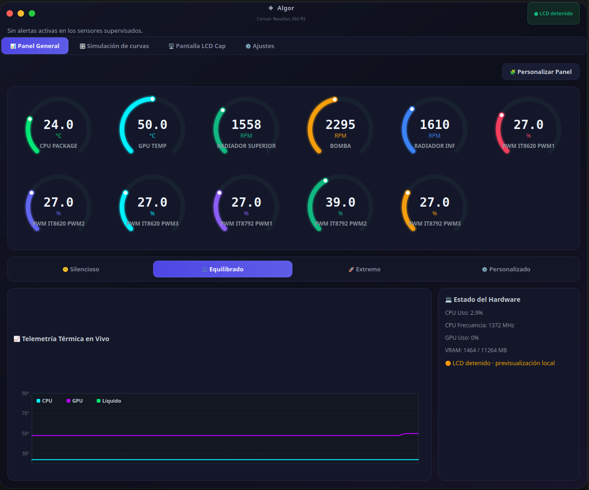
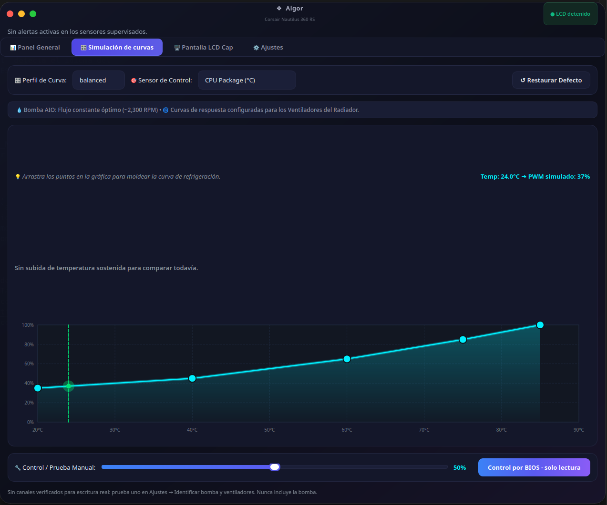
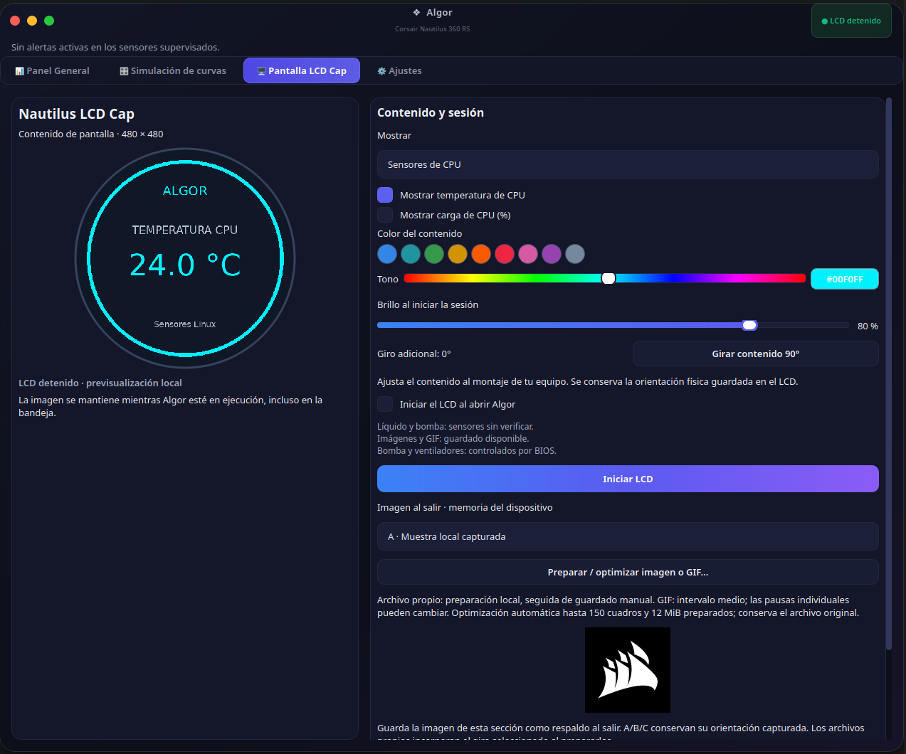
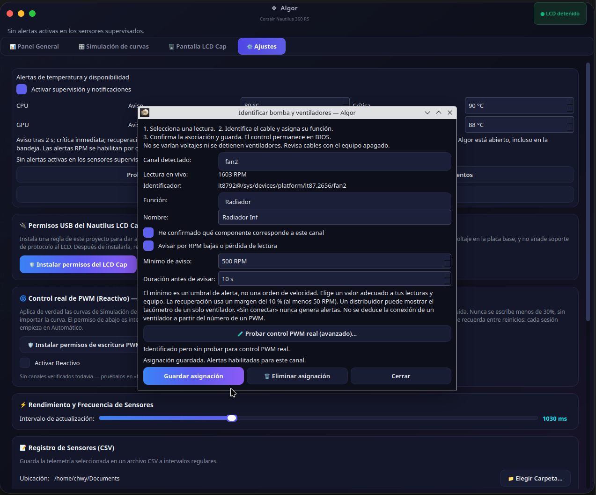
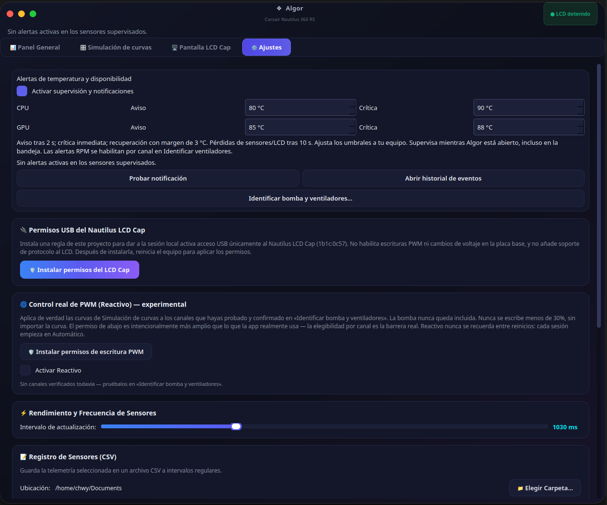
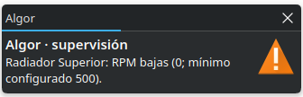
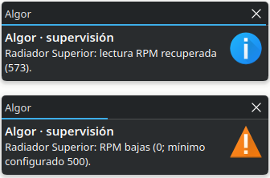
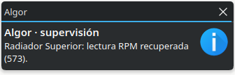

# Algor

Linux desktop application for sensor monitoring and customization of the
**Corsair Nautilus LCD Cap (`1b1c:0c57`)**. Independent project, not affiliated
with Corsair.

🌐 [Leer en español](README.md)

**Early release for community validation.** Confirmed physical compatibility is
limited to the hardware listed below; detecting a chip does not mean all its
connectors have been validated.

## Screenshots

<p align="center">
  
</p>
<p align="center">
  
  
</p>
<p align="center">
  
  
</p>
<p align="center">
  
  
  
</p>

## Features and scope

- CPU temperature and load, GPU telemetry and all available Linux sensors.
- Customizable panel, persistent window state and preferences, CSV export.
- General Panel gauges can be reordered by dragging; the layout is remembered
  across sessions.
- LCD: temperature/load display, images, GIF, color, brightness and rotation.
- Import and optimize custom files; save to LCD onboard memory.
- Temperature alerts, reading loss and LCD error notifications, with history.
- Native system notifications for low RPM and recovery, with per-channel configurable thresholds.
- Wizard to identify pump/fans and enable per-channel RPM alerts.

**Pump and fans remain under BIOS control by default.** The app's fan curves are
a simulation: they do not write PWM unless you explicitly enable the opt-in
**Reactive** mode (Settings → Real PWM Control) on a channel you have tested and
confirmed yourself — the pump is never a candidate, in any mode, and Reactive is
never remembered across reboots. No voltage changes. No Zero RPM mode.
See [docs/PWM_REAL_CONTROL.md](docs/PWM_REAL_CONTROL.md).
**Coolant temperature is not identified** and is shown as unavailable; it is not
replaced by an estimate or a motherboard temperature reading.

## Compatibility

The author tested the LCD Cap on a Gigabyte X99 UD5, Xeon E5-2680 v4 and
Debian 13: images/GIF saved, persistence on exit, brightness, rotation, colors,
notifications, standalone startup and resume after suspend. Full USB power-removal
testing and complete physical validation of the RPM wizard are still pending.
Other LCD models are not supported by the current transport layer.

Intel/AMD sensor readers and NVIDIA/AMD GPU readers are included; availability
depends on kernel, drivers and hardware.
See [the compatibility matrix and testing guide](docs/COMPATIBILITY.md).

## Installing from source

Requirements: Linux desktop, Python **3.10–3.13**, virtual environment, libusb and
Qt graphics libraries. Local installation was validated with Python 3.13; the CI
matrix checks 3.10, 3.12 and 3.13 once it runs on GitHub.

Download the ZIP from **Code → Download ZIP**, extract it and open a terminal in
the folder containing this README. You can also clone the actual URL shown in the
repository's Code button; no example URL is needed.

On Debian 13 / Ubuntu, install system requirements:

```bash
sudo apt update
sudo apt install python3-venv libusb-1.0-0 libegl1 libopengl0 libxcb-cursor0
```

Create the environment and install dependencies:

```bash
python3 -m venv .venv
.venv/bin/python -m pip install -r requirements.txt
.venv/bin/python -m pip check
.venv/bin/python main.py
```

Do not run the application with sudo. Other distributions require equivalent
packages; they still need community testing. Native dependencies are described in
[Qt for Linux](https://doc.qt.io/qt-6/linux-requirements.html).
`requirements-tested.txt` records the exact versions from the local test; to
reproduce it with Python 3.13 you can install that file in a fresh environment.

### USB access for the LCD

You can try the interface and sensors without granting LCD access. To use it,
review and install the specific udev rule:

```bash
bash setup_udev.sh --print-rules
sudo bash setup_udev.sh
```

Reboot after installing. The rule grants access only to USB `1b1c:0c57` for the
active local session via systemd-logind. It does not grant PWM/DC permissions or
general access to other USB devices. If you use a VM, release the LCD to Linux
before starting the session; Windows and iCUE are not required.

### Application menu entry

```bash
.venv/bin/python scripts/install_desktop.py
```

The entry uses the virtual environment interpreter. Keep the project folder and
`.venv`; if you move them, re-run the installer from the new location. In
Settings you can enable launching Algor at login. To start the LCD automatically,
also check **Start LCD when Algor opens**.

## First use

1. Check the sensors in the General Panel; N/A means no valid reading is available.
2. In **LCD Cap Screen**, select sensors or import an image/GIF and click
   **Start LCD**. Brightness and rotation apply to the session.
3. To keep content after exit, stop the session, click **Prepare / optimize
   image or GIF…**, review the result and **Save custom file**. This replaces the
   backup content. Visually confirm persistence after exiting.
4. In Settings, test a notification and set thresholds appropriate for your hardware.
5. Use **Identify pump and fans…** to assign confirmed channels; RPM alerts are
   disabled by default. Empty channels are excluded.

Prepared memory supports up to **150 frames and 12 MiB** — these are app limits,
not a measurement of the LCD's physical capacity. Optimization accepts sources up
to 25 MiB / 600 frames with additional pixel limits. It preserves approximate
duration, but the common interval may alter individual GIF frame delays.

Your media is imported to `~/.local/share/algor/media/`; do not copy files into
the source tree or `assets`. [Media organization](docs/MEDIA.md).
Local research samples A/B/C are optional and not distributed.

## Testing and diagnostics

```bash
.venv/bin/python scripts/run_tests.py
.venv/bin/python scripts/smoke_test.py
.venv/bin/python scripts/diagnostics.py
```

The runner isolates configuration in a temporary folder. The GUI test uses
simulated workers and does not write to USB/PWM. An optional comparison against
USB captures is skipped when private captures are absent; remaining memory tests
use synthetic data. CI is defined in
[.github/workflows/tests.yml](.github/workflows/tests.yml); it is not presented
as having run until GitHub produces results.

Diagnostics shows versions, motherboard, Corsair identifiers and sensor channels;
it does not export configuration, serial numbers or images. Review the output
before attaching it to a report. The event log is at
`~/.local/state/algor/events/`, accessible from Settings.

## Project structure

```text
algor/                 Application code and resources
algor/assets/icons/    Distributable app icon
scripts/               Tests, diagnostics and installation
tests/                Automated tests
docs/                 Guides and compatibility
.github/               CI and issue templates
```

In the development workspace, `local/`, `captures/` and `img/` contain media,
historical files or local symlinks excluded from Git. They are not part of the
public installation.

## Uninstalling

```bash
.venv/bin/python scripts/install_desktop.py --uninstall
```

Removes the menu entry and autostart, keeping configuration and media. You can
then manually delete the project copy and its environment if no longer needed.
The USB rule is preserved; to remove it, delete only
`/etc/udev/rules.d/70-corsair-algor.rules` and reboot. Personal data lives in
`~/.config/algor/`, `~/.local/share/algor/media/` and
`~/.local/state/algor/`; it is not removed automatically.

## Contributing and license

See [CONTRIBUTING.md](CONTRIBUTING.md) and the
[RPM wizard guide](docs/ASISTENTE_VENTILADORES.md).
Issue forms collect bugs and compatibility results without requiring full USB
captures.

Code under [GPL-3.0](LICENSE). Assets and trademarks:
[THIRD_PARTY_NOTICES.md](THIRD_PARTY_NOTICES.md).
